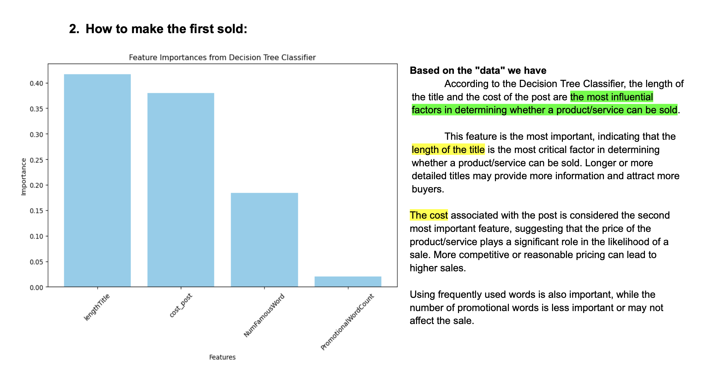

# Fastwork Analysis Project (webscraping + prepareDATA + EDA + Testing hypothesis by using python, machine learning(nlp, regression etc.), excel and using google looker)

## Introduction
Web scraping in Thailand is a legally ambiguous area. We are caution and responsibility while conducting this project to ensure ethical data collection practices. The goal of this project is to scrape data from a specific website, clean and prepare the data, perform exploratory data analysis (EDA), and test various hypotheses using Python, machine learning techniques (such as thai natural language processing for text analysis and regression), and visualization tools like Excel and Google Looker.

## Data Storage
All scraped data links are stored in here:
#### All Scrape Links

## Data Cleaning

After scraping, clean the data to ensure it is ready for analysis. The cleaning process involves:
- Removing null, NaN, or empty data from relevant columns.
- Merging datasets together.
- Dropping duplicate titles.

### Cleaned Data Result
The cleaned data's resul there:

## Data Preparation and Analysis

To enhance the dataset for analysis, additional processing steps are performed, including the use of NLP (Natural Language Processing) techniques. Specifically, NLPthai is utilized to count the number of Thai and English words in the new data (For the Thai language component, I utilized the ThaiNLP library. Unlike English, Thai words are not separated by spaces, necessitating tokenization to identify individual words)

## Relational Database Model Design 
To facilitate easier analysis, prepare and design relational database tables. This structured approach helps in organizing and retrieving data efficiently. (this one just draft)

## Dashboard by google looker studio
This is just 1 dashboard example 
 this dashboard provides a comprehensive analysis of the freelance market, highlighting key areas such as the number of hires and revenue generated across different job categories and subcategories

## Hypothesis 

### 1) what key factors for driving sale?:
We begin our analysis by hypothesizing that various elements of a post, such as title length, cost of the post, frequency of commonly used words, and the count of promotional words, impact its ability to drive sales. To determine which of these factors is most significant, we will utilize the Feature Importance score.

To identify the significance of each factor, we will use the Feature Importance score from a decision tree model. This score will help us understand how each element influences sales, regardless of whether a longer or shorter title is beneficial.

It's essential to note that a higher Feature Importance score does not necessarily imply that a longer title is better. Instead, it indicates that the title length is an important factor that affects sales in some way, whether it is the optimal length or brevity that drives sales. The decision tree will help us understand the impact of each factor on sales.

### 2) Does a Low Price Lead to More Sales?:

Logistic Regression: The coefficient for 'cost_post' shows how changes in cost (price) of the post affect the likelihood of getting a job: Positive coefficient (should sell expensive)

- Positive Coefficient (Bars to the right): If the coefficient for 'cost_post' is positive, it means that higher costs are associated with a higher likelihood of job acquisitions in that sub-category. In other words, as the cost increases, the probability of acquiring a job increases.
  
- Negative Coefficient (Bars to the left): If the coefficient for 'cost_post' is negative, it indicates that higher costs are associated with a lower likelihood of job acquisitions. Thus, as the cost increases, the probability of acquiring a job decreases.

### 3) More detail o Hypothesis How To Sell in FASTWORK.COM:
https://github.com/kkowenn/FastworkAnalysisProject/blob/main/FastWork1HypothesisHowToSell/FastWork1HypothesisHowToSell.pdf

## Final Work 
https://medium.com/@data.tanaboon/%E0%B8%AB%E0%B8%B2%E0%B8%A3%E0%B8%B2%E0%B8%A2%E0%B9%84%E0%B8%94%E0%B9%89%E0%B9%80%E0%B8%AA%E0%B8%A3%E0%B8%B4%E0%B8%A1%E0%B8%94%E0%B9%89%E0%B8%A7%E0%B8%A2%E0%B8%87%E0%B8%B2%E0%B8%99%E0%B8%A7%E0%B8%B4%E0%B9%80%E0%B8%84%E0%B8%A3%E0%B8%B2%E0%B8%B0%E0%B8%AB%E0%B9%8C%E0%B8%82%E0%B9%89%E0%B8%AD%E0%B8%A1%E0%B8%B9%E0%B8%A5-data-analyte-%E0%B8%9A%E0%B8%99-fastwork-b0c86aac2c58

teammate:
Kritsada kruapat, Sub.Soravit, Nattida SupmeechaiTanaboon Charoenchon,

