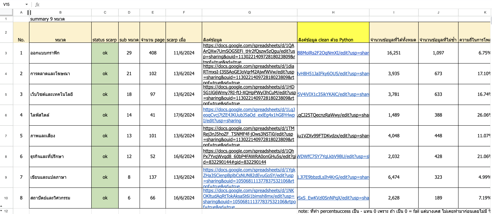
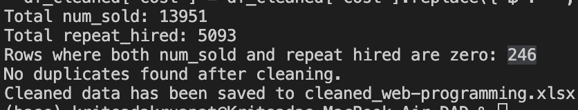
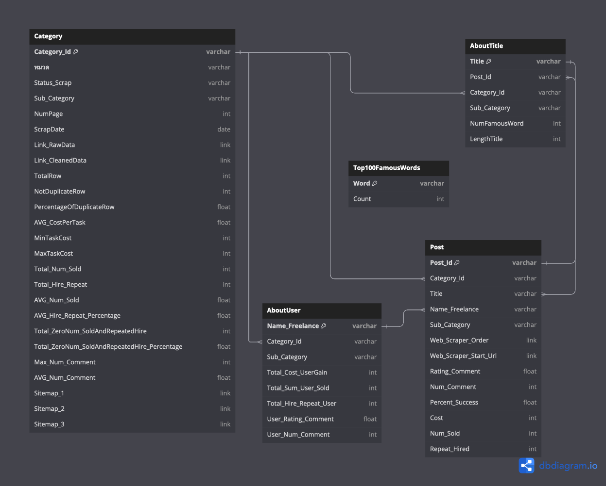
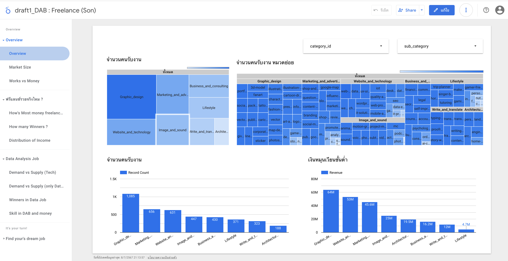
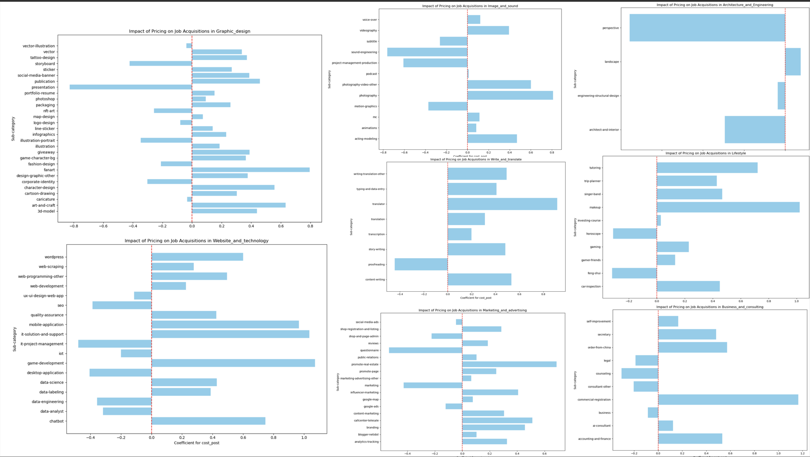

# Fastwork Analysis Project (webscraping + prepareDATA + EDA + Testing hypothesis by using python, machine learning(nlp, regression etc.), excel and using google looker)

## Introduction
Web scraping in Thailand is a legally ambiguous area. We are caution and responsibility while conducting this project to ensure ethical data collection practices. The goal of this project is to scrape data from a specific website, clean and prepare the data, perform exploratory data analysis (EDA), and test various hypotheses using Python, machine learning techniques (such as thai natural language processing for text analysis and regression), and visualization tools like Excel and Google Looker.

### Steps for Web Scraping

1. **Install Scrapy.io**
   - Ensure Scrapy.io is installed on your system to begin the scraping process.

2. **Inspect the Website**
   - Open Google Chrome.
   - Navigate to the target website.
   - Right-click anywhere on the webpage and select "Inspect".

3. **Web Scraper Configuration**
   - In the Inspect panel, find and click on the "Web Scraper" tab.
   - Click "Create new sitemap" and then "Import sitemap".
   - Configure your sitemap according to the website structure.

4. **Scrape the Website**
   - Once the sitemap is configured, click "Scrape".
   - Wait for the scraping process to complete.
   - Export the scraped data for further processing.

## Data Storage
All scraped data links are stored in here:
#### All Scrape Links

## Data Cleaning

After scraping, clean the data to ensure it is ready for analysis. The cleaning process involves:
- Removing null, NaN, or empty data from relevant columns.
- Merging datasets together.
- Dropping duplicate titles.

### Cleaned Data Result
The cleaned data's resul there:

## Data Preparation and Analysis

To enhance the dataset for analysis, additional processing steps are performed, including the use of NLP (Natural Language Processing) techniques. Specifically, NLPthai is utilized to count the number of Thai and English words in the new data (For the Thai language component, I utilized the ThaiNLP library. Unlike English, Thai words are not separated by spaces, necessitating tokenization to identify individual words)

## Relational Database Model Design 
To facilitate easier analysis, prepare and design relational database tables. This structured approach helps in organizing and retrieving data efficiently. (this one just draft)

## Dashboard by google looker studio
This is just 1 dashboard example 
 this dashboard provides a comprehensive analysis of the freelance market, highlighting key areas such as the number of hires and revenue generated across different job categories and subcategories

## Testing hypothesis #1
https://github.com/kkowenn/FastworkAnalysisProject/blob/main/FastWork1HypothesisHowToSell/FastWork1HypothesisHowToSell.pdf
- Low price make more sold??

This is just 1 example in FastWork1HypothesisHowToSell.png in this repo

Logistic Regression: The coefficient for 'cost_post' shows how changes in cost (price) of the post affect the likelihood of getting a job: Positive coefficient (should sell expensive)
- Positive Coefficient (Bars to the right): If the coefficient for 'cost_post' is positive, it means that higher costs are associated with a higher likelihood of job acquisitions in that sub-category. In other words, as the cost increases, the probability of acquiring a job increases.
  
- Negative Coefficient (Bars to the left): If the coefficient for 'cost_post' is negative, it indicates that higher costs are associated with a lower likelihood of job acquisitions. Thus, as the cost increases, the probability of acquiring a job decreases.

